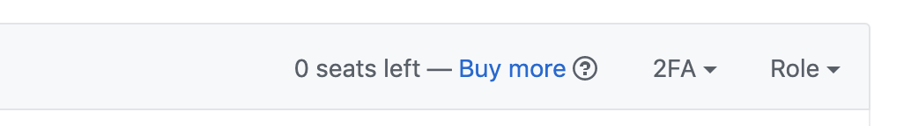

# Workflow for onboarding new members to services (requires admin rights to all resources)

To fully onboard, a new member must:
 - Have a PI or PM fill out the onboarding [form](https://www.nih-cfde.org/onboarding-form/)
 - Accept our GitHub invite
 - Accept our Slack invite
 
 We track those events, as well as our progress in adding them to our resources [here](https://docs.google.com/spreadsheets/d/16JcTqlkCRPqrSnykqshrVM2XLf_3HJJiPpAb7qBaOug/edit?usp=sharing).

## Onboarding Overview
The Onboarding form will send notifications to support@cfde.atlassian.net whenever the form is filled out. 

A member of the coordination team should begin the onboarding process for new forms *within 2 business days*. Full onboarding for each person is a typically a multi-day process, and can be done by multiple members of the coordination team, because we have to wait for each new onboardee to accept the invitations. The basic workflow is:
  
  - Add them to our Google Group, and send them an invitation GitHub
  - Add them to the correct mailing lists
  - Add their name to the "Welcome" list in the Weekly Announcements
  - Wait for them to accept the invitations

## Onboarding Walkthrough
To onboard new members you will need to go to the [Forminator plug-in](https://www.nih-cfde.org/wp-admin/admin.php?page=forminator-entries) on the CFDE Wordpress site. Here you can view the most recent onboards with date submitted. By selecting submissions you can view the entries made for onboarded individuals. 
Alternatively, you may select **Export** and download a CSV for all submissions. In either case you will need to copy the relevant details and transfer them to the [Onboarding Reponses Google Sheet](https://docs.google.com/spreadsheets/d/16JcTqlkCRPqrSnykqshrVM2XLf_3HJJiPpAb7qBaOug/edit?usp=sharing) where you will begin the onboarding process. 

On this sheet, partially onboarded members will have some boxes checked. Onboarding tasks should be completed (or checked up on) from left to right for each individual.
  
### Google Group adds

  If 'Added to Google Group?' is unchecked:
   - Copy their email address from "Alternate email for Google Drive", if they don't have one, use the email address in "Email Address"
     - Note : If the e-mail is a commercial (.com) address, but not from a big service provider (gmail / hotmail) Google Groups may not give them access, the Onboarding Form recommends users give a non-commercial address, but it's good, as administrator, to be aware that you may need to ask them to change/create a different e-mail for full access. 
   - Note their Title/Position from column P and affiliation from column O
   - Decide what Google Permissions group to add them to:
      - For members of Teams Brown or White **who are working on infrastructure or data access management**, ask Amanda and add them to [CFDE_Admin](https://groups.google.com/forum/#!managemembers/cfde_admin/add) only after her explicit approval
      - For everyone else, choose [CFDE_Everyone](https://groups.google.com/forum/#!managemembers/cfde_everyone/add)
   - (You can also reach those pages by going to [Google Groups](https://groups.google.com/forum/#!myforums), choosing 'Manage members' for the appropriate group, and then clicking 'Direct add members' on the left side of the screen.)
   - Enter the email address of the person you want to onboard. If you have more than one to add to a given group, you can add multiple, comma-seperated, email addresses
   - Ensure that the welcome message box is filled correctly (see below), then click `Add` at the top of the screen
   - Check the 'Added to Google Group?' box for each person you added

#### Google Group Welcome Messages

Google groups sometimes caches the correct welcome messages, however you can copy/paste in one from below if they get erased:

##### Admin
```
Welcome to the CFDE working group. 

You have been added to Admin. You will have: 

- Edit access to CFDE_Everyone- day to day documents for the CFDE 
- Edit access to CFDE_Admin- documents for administration of CFDE infrastructure 

You can access these groups in your google drive under Team Drives 

If you have any problems, please email our help desk mailto:support@cfde.atlassian.net

- CFDE Onboarding Team
```
##### Everyone

```
Welcome to the CFDE working group. 

You have been added to Everyone. You will have: 

- Edit access to CFDE_Everyone- day to day documents for the CFDE 
- View access to CFDE_Admin- documents for administration of CFDE infrastructure 

You can access these groups in your google drive under Team Drives 

If you have any problems, please email our help desk mailto:support@cfde.atlassian.net

- CFDE Onboarding Team
```

### Slack space adds

As of 7/15/2019 new members are automatically sent a Slack invitation by Groups.io

### Add to Mailing lists

If 'Mailing Lists Assigned??' is unchecked:

 - Copy their email address from "Alternate email for Google Drive", if they don't have one, use the email address in "Email Address"
 - Copy their name from column K
 - Note the mailing lists they requested to join in column Q (see NOTE1 for help)
 - Go to [direct add for the general mailing list](https://cfde.groups.io/g/General/directadd)
 - Paste the following text in the 'Customize Message' box (note, you may need to copy the links and then use the 'link' button to re-add them for the Code of Conduct and License sections):
 
---
To complete your access, you'll need to accept the invitation to join our GitHub repository `nih-cfde`.

If you do not receive your invitation or are having trouble with our resources, visit our Onboarding Help
or [email the HelpDesk](CFDE+coordination+int+1481+4810093048235559374@groups.io).

For help using all of our communication resources visit our [Communication Management Help page](https://github.com/nih-cfde/organization/blob/master/CommunicationManagementHelp.md).

Please remember that all interactions in the CFDE Google Drive spaces, Github repositories, Slack, groups.io and any other CFDE managed spaces are bound by the [CFDE Code of Conduct](https://cfde-welcome-to-cfde.readthedocs-hosted.com/en/master/General_Onboarding/CODEOFCONDUCT/). By participating in any of these community spaces you are agreeing to abide by these rules.

All documents in the CFDE Google Drives and GitHub repositories are assumed to be under the [CFDE License](https://cfde-welcome-to-cfde.readthedocs-hosted.com/en/master/Resources/License/) unless another license is specified in the document.

CFDE Onboarding Team

---

 - Check the boxes for their selected lists (you can do multiple new members at a time)
 - Add their name and address to the 'Emails' box in this format: `Name <email@example.com>`
 - Click `+ Add Members`
 - Check the 'Mailing Lists Assigned??' box for each person you added
 
     NOTE1: I find it hard to read column Q for members that choose more than one list.
     If you prefer, you can read their choices directly off their form. To do that:
       
      - Go to [the form view for onboarding](https://docs.google.com/forms/d/1sFY6y2eHB3PS0HayEyxXtZOrBJV7lfT8thJ8bL9wKqQ/edit#responses)
      - Click on the 'Individual' tab
      - Click where it says 'achar@ucdavis.edu'. That will open a selection box where you can choose the email address of the member you're working on
      - Choose the right email address
      - Scroll to the bottom of their form to the 'Mailing List Options' section      

### Cross-Pollination Mailing lists

Currently all members on-boarding to the CFDE are also being added to the Cross-Pollination groups.io mailing list

- Copy their email address from "Email Address"
- Copy their name from column K
- Go to [direct add for the cross-pollination mailing list](https://cfdepublic.groups.io/g/CFDEPublicMain/directadd)
- Paste the following text in the 'Customize Message' box (note, you may need to copy the links and then use the 'link' button to re-add them for the Code of Conduct and License sections):

---
This mailing group gives you access to information about upcoming Common Fund Data Ecosystem (CFDE) Cross-Pollination Events. Cross-Pollination announcements, calendars, and invitations will all be coordinated through this group.

A [Cross-Pollination Event Calendar](https://groups.io/g/CrossPollinationEvents/calendar) is available for you to view schedules and details of meetings, or you can visit the [Google Sheet](https://docs.google.com/spreadsheets/d/1hQAeOLkivUZZnwZ_KxfGw3neezMaWbrPk9nnFiKfQGA/edit?usp=sharing) with the details of the entire series on one page.

The CFDE Cross-Pollination Events and this group are open to anyone interested in joining, so if you have colleagues you think would be interested, please share our information. New members can join by going to this link and clicking on the Join Group button: https://cfdepublic.groups.io/g/CrossPollinationEvents

Please remember that all interactions in the CFDE Google Drive spaces, Github repositories, Slack, groups.io and any other CFDE managed spaces are bound by the [CFDE Code of Conduct](https://cfde-welcome-to-cfde.readthedocs-hosted.com/en/master/General_Onboarding/CODEOFCONDUCT/). By participating in any of these community spaces you are agreeing to abide by these rules.

All documents in the CFDE Google Drives and GitHub repositories are assumed to be under the [CFDE License](https://cfde-welcome-to-cfde.readthedocs-hosted.com/en/master/Resources/License/) unless another license is specified in the document.

CFDE Coordination Team

---
 - Check the 'Cross Pollination Events' box
 - Add their name and address to the 'Emails' box in this format: `Name <email@example.com>`
 - Click `+ Add Members`
 - Make sure you have checked the 'Mailing Lists Assigned??' box for each person you added if you haven't already for the general group
 
### GitHub adds

  If 'GitHub Invite Sent?' is unchecked:
  - Copy their GitHubID from column N
  - Note their Title/Position from column P and affiliation from column O
  - Go to [the people list on GitHub](https://github.com/orgs/nih-cfde/people)
  - Look at the `Buy more` text:
    

  If it says '0 seats left':
  - Click on `Buy more`
  - Change the number of seats to add to the number of people you are onboarding right now
  - Click `Add seats`
  - Now there's seats!

  If it does not say '0 seats left':
  - Paste their GitHubID into the box that says `Invite by username, full name, or email address` and click `Invite`
  - Scroll down and click 'Show all XX teams'
  - Based on their Title/Position and affiliation, add them to as many teams as is appropriate
  - Click `Send Invite`
  - Check the 'GitHub Invite Sent?' box for each person you added


### Announcements

If 'In Announcements?' is unchecked:

- Go to [the issues for the announcements repo](https://github.com/nih-cfde/announcements/issues?utf8=%E2%9C%93&q=is%3Aissue+is%3Aopen+Announcements)
   - Click on the issue called "Weekly Announcements"
   - Scroll to the bottom of the page to the text box.
   - Make the first line say `# Welcome`
   - List the name and group affiliation of each person added in: `Brown Group: Amanda Charbonneau, Titus Brown`
   - Click the `Comment` button
   
   
### Special additions for PMs, PIs and Admin contacts

For most places:
- the PI on the grant is the Principal Investigator
- the Administrator Contact is the person I would ask things like "how much money did your grant spend in March?" not things like "hey when is Bobs calendar open"
- the PM is the head PM of that group. the person you contact to find out why their deliverable isn't done, or where some product is. 

If the person you are onboarding is a PI, PM or Administrative contact for *any* team, they should be added to the [Points of Contact](https://github.com/nih-cfde/organization/blob/master/PointsOfContact.md) list:
  - Navigate to [Points of Contact](https://github.com/nih-cfde/organization/blob/master/PointsOfContact.md) on GitHub
  - Use the edit feature to add them and issue a pull request. For help with pull requests, see the [GitHub Usage Guide](./GitHubUsage.md)
  
 If you are unsure whether a newly onboarded person needs to go on the Point of Contact List, ask Amanda Charbonneau.


### Check Slack Invite

If 'Slack Invite Accepted?' is unchecked:
  - Go to [the admin page for slack](https://cfdeworkspace.slack.com/admin/invites#pending) (you may need to log into your Slack account)
  - If their invitation has moved to 'Accepted Invitations', click the checkbox
  - You can search for them using their email address in "Email Address"
  - Check the 'Slack Invite Accepted?' box for each person you added

 ### Check GitHub Invite
 
 If 'GitHub Invite Accepted?' is unchecked:
  - Go to [the people list on GitHub](https://github.com/orgs/nih-cfde/people)
  - Click on 'X pending invitations'. It will be just below the `Invite member` button.
  - Use the dialogue box to update 'GitHub Invite Accepted?' checkmarks
  
  

   
   
  
